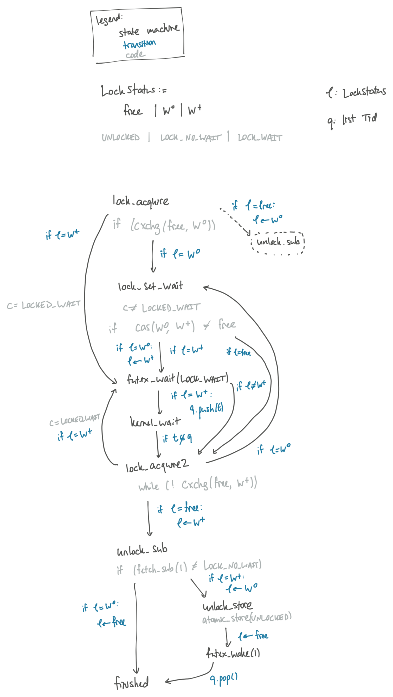

# Verifying a mutex using Ivy

Proof of correctness (safety and liveness) for a futex-based mutex, as modeled
in [Ivy](https://kenmcmil.github.io/ivy/). This development has proofs for two
mutexes: [mutex.ivy](mutex.ivy) has a mutex that uses a futex and a simple
boolean flag for the lock state, while [better_mutex.ivy](better_mutex.ivy) is
more sophisticated and tracks a little extra state.

The C code corresponding to the simple mutex
is at
[mutex.c](https://github.com/tchajed/futex-tutorial/blob/main/mutex.c) while the
better mutex is at [mutex_better.c](https://github.com/tchajed/futex-tutorial/blob/main/mutex_better.c).

These proofs use Ivy's liveness-to-safety reduction feature, described in [this
POPL 2018
paper](https://cs.stanford.edu/~padon/reducing-liveness-to-safety-in-first-order-logic/popl18-reducing-liveness-to-safety-in-first-order-logic.pdf).
Oded Padon helped use Ivy and especially the l2s feature, and figured out most
of the important invariants.

## (Simple) mutex

Here's a diagram of the state machine being verified:

The state machine corresponds to a single thread calling `lock()` followed by
`unlock()` on a single mutex. What is modeled in Ivy is an arbitrary number of
threads going through this state machine, with global state for the lock itself
and a list of threads used to model the futex, explained below. This model
ignores the critical section in between lock and unlock, because we implicitly
assume the critical sections terminate. (We don't consider multiple mutexes
because then the system could deadlock due to a lock ordering cycle, and we
would need to somehow assume that doesn't happen.)

This code uses _futexes_. See my [futex
tutorial](https://github.com/tchajed/futex-tutorial) for a more in-depth
explanation, but here's a brief one. Futexes ("fast user-space mutexes") are a
kernel mechanism that help implement thread synchronization mechanisms in
userspace. The main two calls are `futex_wait(p, val)` and `futex_wake(p, n)`,
where `p` is an arbitrary pointer naming the futex. The core idea is that a call
to `futex_wait` puts the caller to sleep until a future call to `futex_wake`, on
the same pointer. The `n` argument to `futex_wake` is the number of threads to
wake up, typically either 1 or `INT_MAX`, and 1 for this mutex.

What does this mutex code do? Lock repeatedly tries to acquire the lock with an
`atomic_cas`. When this fails, unlike a spin lock, the C code calls
`futex_wait`. The `futex_wait` call takes an argument with the semantics that in
the kernel, the `futex_wait` call atomically checks that the mutex still has the
value `true` (locked) before putting the thread to sleep, which is modeled by
atomically checking the value of the mutex before adding the current thread ID
to a queue and moving to the `kernel_wait` state. If the mutex is free by the
time `futex_wait` is called, instead of waiting for a signal the thread
immediately tries to acquire the lock again (this is necessary for liveness) -
in C `futex_wait` returns immediately with an error, which is treated the same
as a signal. Wake-up is modeled by removing a thread from the queue and thus
enabling `kernel_wait` to return.

The unlock code is straightforward - it unlocks the mutex, then signals to any
threads waiting on the lock with `futex_wake`.

Despite its apparent simplicity, the liveness of this state machine isn't that
simple. Try to think of a formal argument for why all threads terminate. Now
consider three things: first, why is it necessary in `futex_wait` to atomically check
that the lock is still held and wait in the kernel? Second, I claim that if
`atomic_store` and `futex_wake` were reversed, the mutex would no longer have
liveness - why? Third, is it possible for a thread to return from `kernel_wait`
but then fail to acquire the lock? (Hint: yes, but why?)

## Better mutex

We also verified a better mutex implementation in
[better_mutex.ivy](better_mutex.ivy). This code adds an optimization: if no
threads are waiting for the lock, we can save some cycles by skipping the call
to `futex_wake` in `unlock`. This is especially useful for situation where
there's low contention but the mutex is required for safety. Of course it's
important that the code accurately track if threads are waiting, otherwise you
could easily imagine a thread waiting for a signal that will never come.

